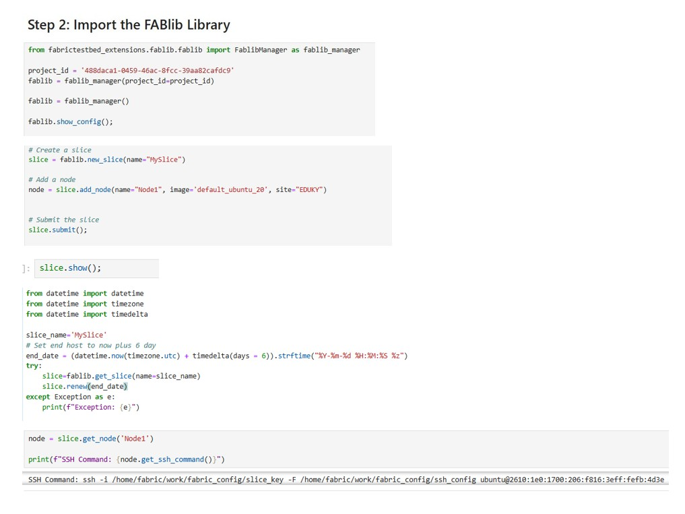
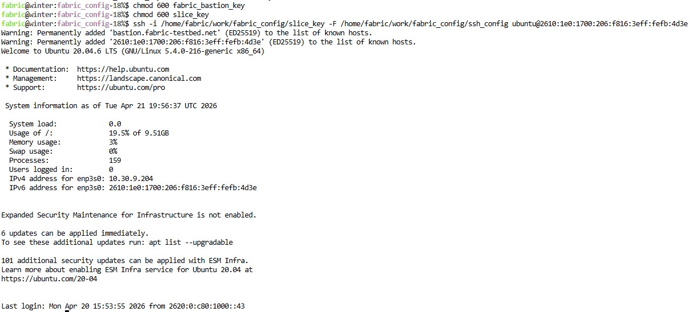
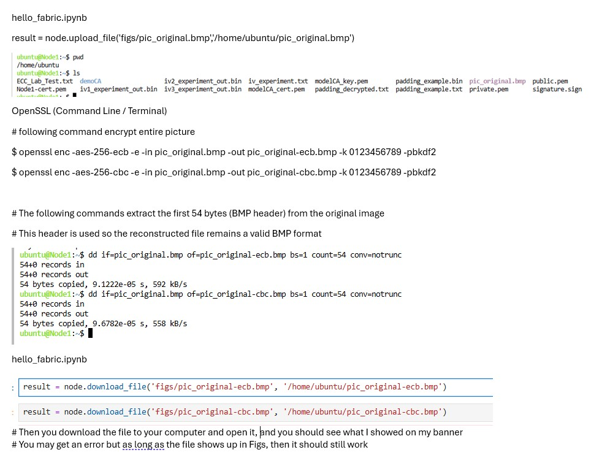
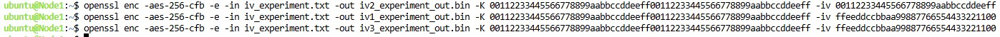
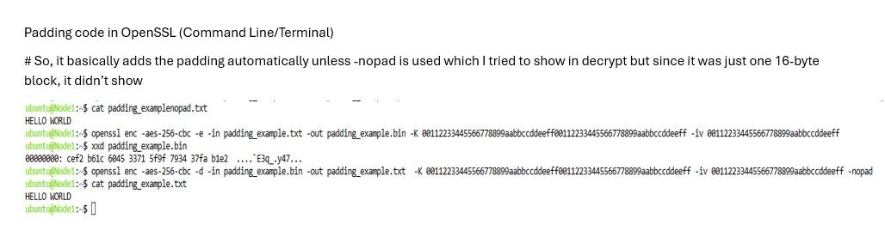

# Code Snippets – AES Block Cipher Mode Analysis

## Environment Setup

Code needed to execute before setting up the Terminal

Setup code for actual terminal ater Notebook execute

## ECB Vs CBC Image Comparison Code 

## IV Behavior with encryption Mode Behavior

Even though the code shows the key and IV, it's demo purposes & enterprise would not be show

## Padding Behavior

Again normally the private key and IV would not be displayed if not in a demonstration.

