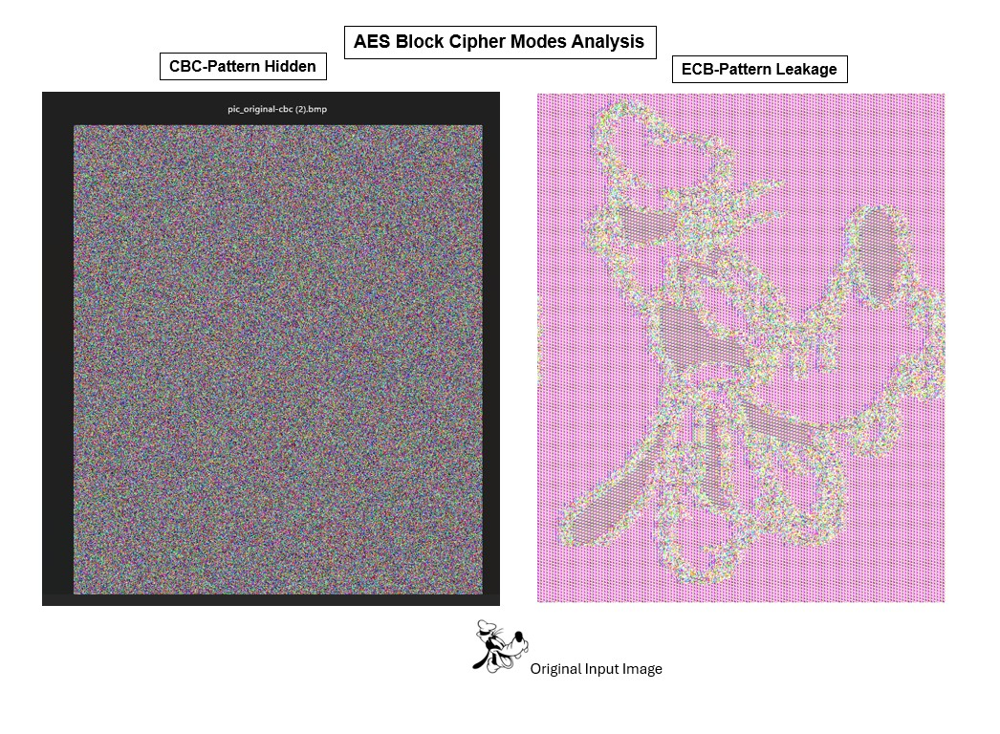

# AES Block Cipher Modes Analysis (ECB, CBC, CFB, OFB)

  

## Overview
This project analyzes AES block cipher modes through practical OpenSSL experiments and image encryption. The comparison demonstrates how ECB leaks plaintext patterns, while CBC obscures image structure through chaining and IV usage.

---

## Environment
- Linux virtual machine
- OpenSSL (AES encryption/decryption)
- Python (Jupyter Notebook)
- Hex inspection tools

---

## Experiments

### ECB Image Encryption
The BMP header is preserved to allow rendering of encrypted pixel data. ECB mode preserves pixel pattern structure, making the original image partially visible through repeating ciphertext regions.

### CBC Image Encryption
CBC uses an initialization vector (IV) and block chaining to obscure structure. This removes direct correlation between plaintext blocks, producing a noise-like output image.

---

## IV Behavior Analysis
Initialization Vectors (IVs) were analyzed to demonstrate their role in preventing identical plaintext from producing identical ciphertext across encryptions.

When a random IV is used, the same input can generate different ciphertext outputs each time. This improves confidentiality and prevents pattern reuse.

---

## Padding and Stream Behavior

- ECB and CBC require padding when plaintext is not a multiple of the block size
- CFB and OFB do not require padding because they behave like stream modes
- A full block of padding is added when plaintext exactly matches block size

---

## Key Observations

- ECB exposes plaintext structure through repeating ciphertext patterns
- CBC reduces pattern leakage through IV-based chaining
- CFB and OFB behave like stream ciphers in practice
- Proper mode selection significantly impacts confidentiality
