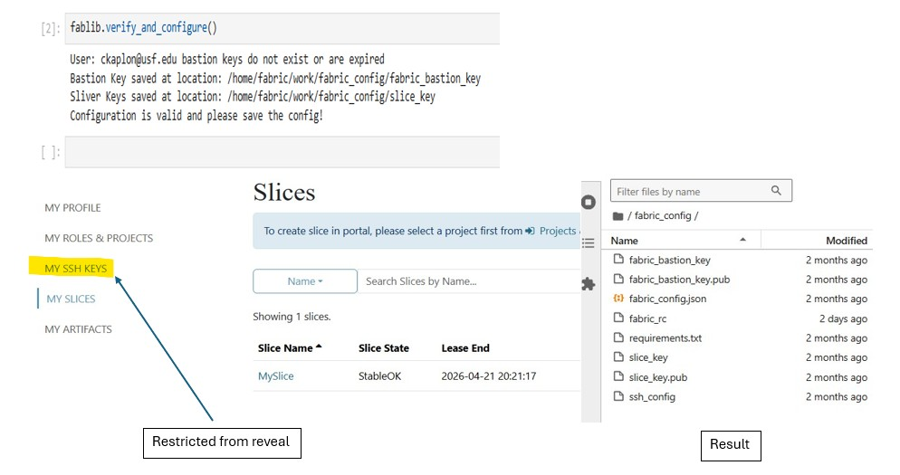
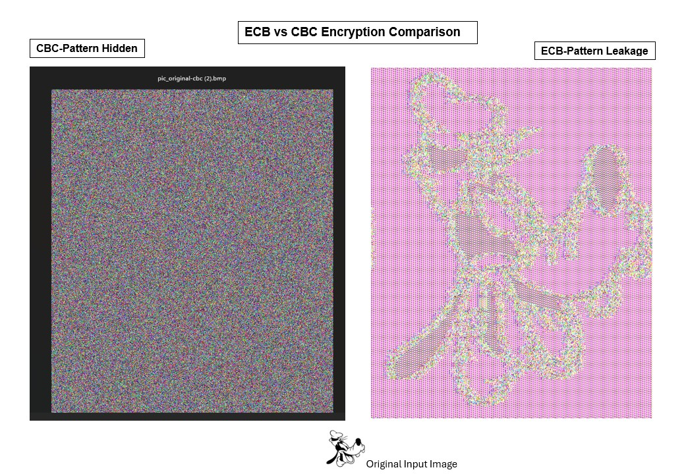

# Results – AES Block Cipher Mode Analysis

## Environment Setup

## ECB vs CBC Comparison

ECB encryption preserves visible structure from the original image, making patterns detectable in the ciphertext output.

CBC significantly reduces pattern visibility by using an initialization vector (IV) and chaining blocks together.

---

## CFB vs OFB Behavior

CFB and OFB behave like stream modes, producing ciphertext that does not reveal block-level structure and does not require padding.

---

## Padding Behavior (PKCS#7)

Short plaintexts require padding to reach the AES block size of 16 bytes. When input already matches the block size, a full padding block is added.

---

## Key Observations

- ECB preserves visual patterns in encrypted output
- CBC reduces structure leakage through IV-based chaining
- CFB and OFB behave like stream ciphers
- Padding behavior depends on input size alignment and mode type
