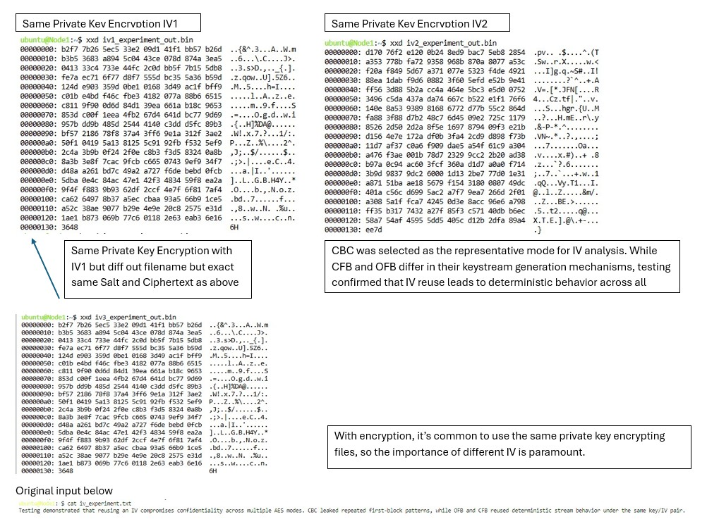

# Results – AES Block Cipher Mode Analysis

## Environment Setup

## ECB vs CBC Comparison

- ECB encryption preserves visible structure from the original image, making patterns detectable in the ciphertext output.
- And this is the exact excrypted image...but in order to see make the encrypted image visible had to replace encrypted header with standard image header info but you can still see the CBC hides the image while ECB leaks the pattern.
-  CBC significantly reduces pattern visibility by using an initialization vector (IV) and chaining blocks together.

## IV Behavior with encryption Mode Behavior

CFB and OFB behave like stream modes, producing ciphertext that does not reveal block-level structure and does not require padding.

## Padding Behavior (PKCS#7)

Short plaintexts require padding to reach the AES block size of 16 bytes. When input already matches the block size, a full padding block is added.

---

## Key Observations

- ECB preserves visual patterns in encrypted output
- CBC reduces structure leakage through IV-based chaining
- CFB and OFB behave like stream ciphers
- Padding behavior depends on input size alignment and mode type
